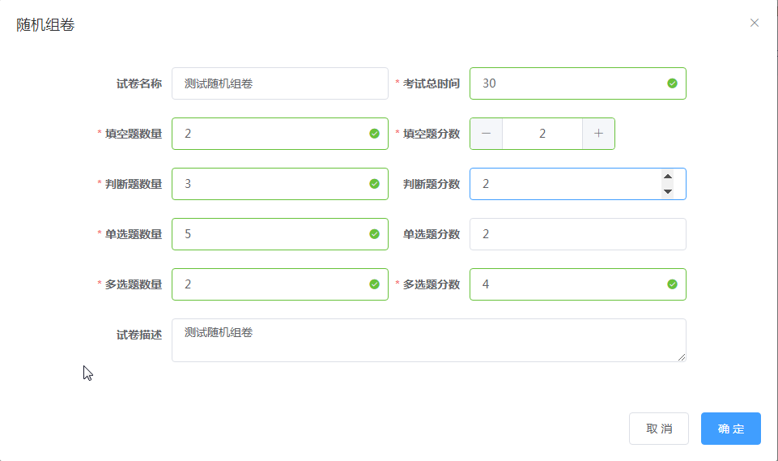
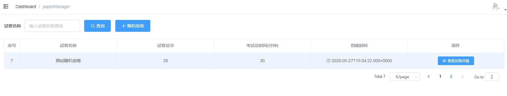
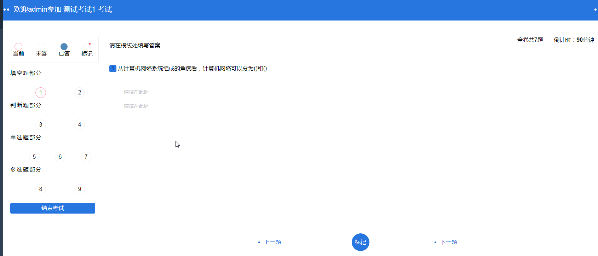
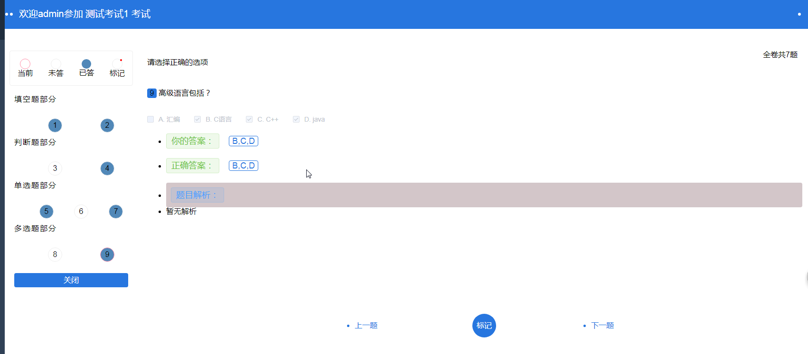

这是一个在线考试系统的后端部分  
主要包括以下功能：  
（1）在线考试，包含填空题、判断题、单选题、多选题四种题型，填空题的答案比对，现在只是一一对应才算正确  
（2）新增题库，新增以上四种类型题目  
（3）提供随机组卷的功能  
（4）查看考试记录，并且可以展示每道题的答题情况  

项目采用的主要包括但不限于以下技术：  
（1）springBoot  
（2）springSecurity  
（3）jwt  
（4）mybatis  
（5）vue、vuex、vue-router等  

在线组卷：  

在线参加考试：

查看试卷：

